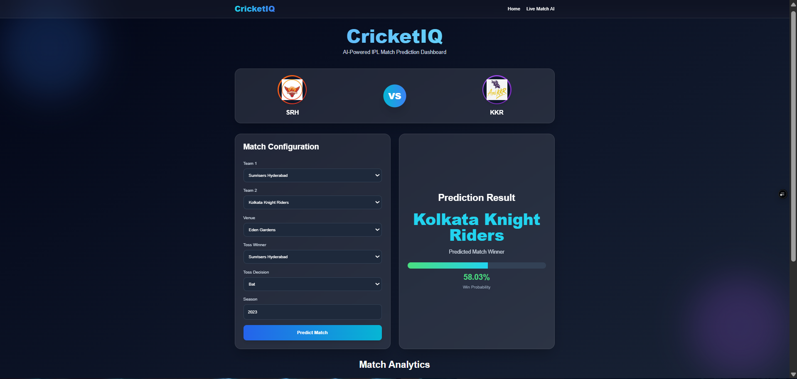
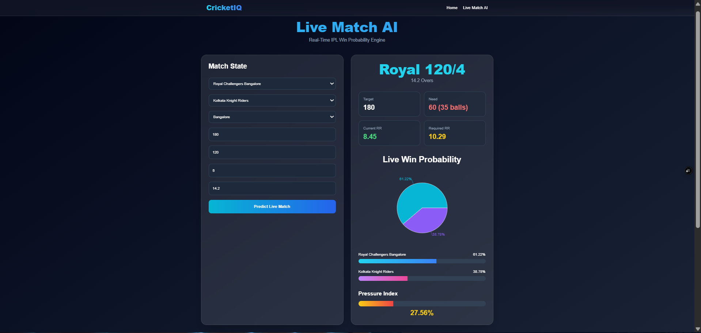
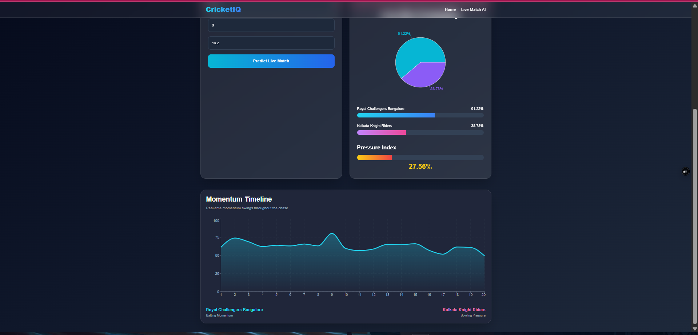
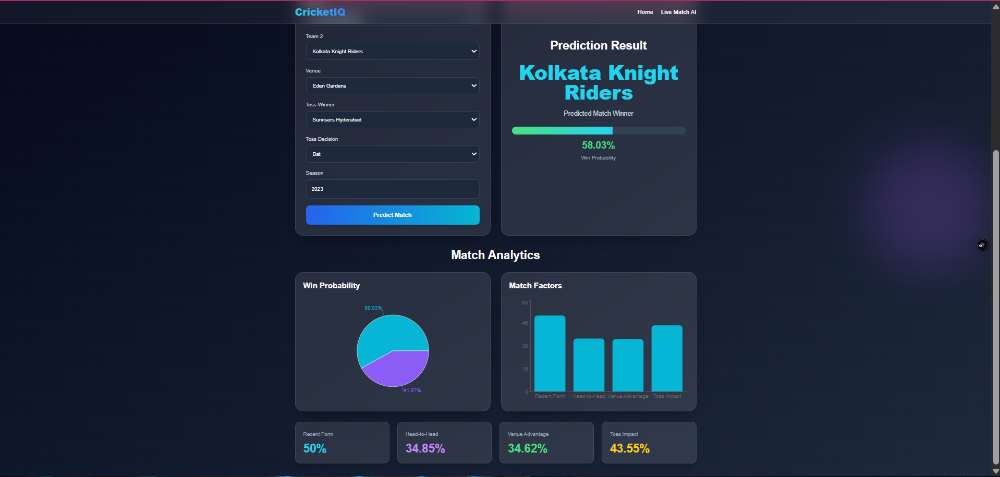

# CricketIQ 🏏

### AI-Powered IPL Match Prediction & Live Analytics Platform

CricketIQ is a full-stack AI-powered cricket analytics platform that predicts IPL match outcomes using Machine Learning and provides real-time live match win probability analysis through an interactive sports dashboard.

Built with **React, FastAPI, XGBoost, Recharts, and TailwindCSS**, the platform combines modern UI design with real-world cricket analytics and ML intelligence.

---

# 🚀 Live Demo

### 🌐 Frontend

[CricketIQ Live App](https://cricket-iq-5ipq.vercel.app/?utm_source=chatgpt.com)

### ⚡ Backend API

[CricketIQ Backend API](https://cricketiq-d9pw.onrender.com/docs?utm_source=chatgpt.com)

---

# ✨ Features

## 🧠 AI Match Prediction

- Predict IPL match winners
- Toss impact analysis
- Venue-based analytics
- Team form comparison
- Head-to-head analysis

---

## 📊 Live Match AI Dashboard

- Real-time win probability engine
- Dynamic probability bars
- Pressure index meter
- Chase difficulty estimation
- Current vs Required Run Rate analysis

---

## 📈 Momentum Engine

- Over-by-over momentum tracking
- Match pressure swing visualization
- Live probability trend graphs
- Match situation analytics

---

## 🎨 Modern Sports UI

Inspired by:

- Cricbuzz
- Formula 1 analytics dashboards
- Modern sports intelligence platforms

Features:

- Glassmorphism cards
- Responsive design
- Animated dashboards
- Interactive charts
- Dark sports-theme interface

---

# 🛠️ Tech Stack

## Frontend

- React.js
- Vite
- TailwindCSS
- Recharts
- Axios
- React Router DOM

---

## Backend

- FastAPI
- Python
- Pydantic
- Uvicorn

---

## Machine Learning

- XGBoost
- Scikit-learn
- Pandas
- NumPy
- IPL historical datasets

---

## Deployment

- Frontend: Vercel
- Backend: Render

---

# 🧠 Machine Learning Pipeline

The prediction engine was trained on historical IPL match and ball-by-ball datasets.

### Model Features

- Batting team
- Bowling team
- Venue / city
- Target score
- Current score
- Overs completed
- Wickets left
- Run rate
- Required run rate
- Match pressure
- Toss impact
- Venue advantage

### Algorithms Used

- XGBoost Classifier
- Feature Engineering
- Real-time probability modeling

### Model Accuracy

✅ Achieved approximately **94–96% validation accuracy** on processed historical IPL datasets.

---

# ⚠️ Limitations & Challenges

Although the platform performs well on historical IPL data, there are several practical limitations that affect real-world prediction accuracy:

## 📉 Limited Dataset Availability

- IPL datasets do not fully capture:
  - player injuries
  - player form fluctuations
  - pitch conditions
  - weather changes
  - squad changes
  - toss pressure dynamics

This can reduce prediction reliability during unusual match situations.

---

## 🎯 Real Match Complexity

Cricket is highly dynamic and contains unpredictable events such as:

- sudden batting collapses
- exceptional player performances
- dew factor impact
- pressure moments in death overs

These real-world factors are difficult to model perfectly using historical tabular data alone.

---

## ⏱️ No Real-Time API Integration

Currently:

- match data is manually entered
- live ball-by-ball APIs are not integrated

Future versions will support:

- Cricbuzz APIs
- live score streaming
- automated momentum updates

---

## 🤖 Probability Calibration

The live prediction engine may occasionally produce:

- overly aggressive probabilities
- sharp swings during late overs
- biased outcomes in edge cases

This is primarily due to:

- class imbalance
- insufficient ball-by-ball context
- limited contextual cricket intelligence

---

## 🧪 Experimental AI System

CricketIQ is designed as:

- an AI analytics learning platform
- a sports intelligence prototype
- an end-to-end ML deployment project

Predictions should therefore be interpreted as:

### probabilistic estimates rather than guaranteed outcomes.

---

# 📷 Screenshots

## Home Dashboard



---

## Live Match AI Dashboard



---

## Momentum Engine



---

## Match Analytics



---

# ⚙️ Installation & Setup

## Clone Repository

```bash
git clone https://github.com/AbhinavPandey-afk/CricketIQ.git
cd CricketIQ
```

---

# Backend Setup

```bash
cd backend

pip install -r requirements.txt

uvicorn app.main:app --reload
```

Backend runs on:

```text
http://127.0.0.1:8000
```

---

# Frontend Setup

```bash
cd frontend

npm install

npm run dev
```

Frontend runs on:

```text
http://localhost:5173
```

---

# 📡 API Endpoints

## Match Prediction

```http
POST /predict
```

---

## Live Match Prediction

```http
POST /predict_live
```

---

# 🏗️ Project Structure

```text
CricketIQ/
│
├── backend/
│   ├── app/
│   │   ├── main.py
│   │   ├── ml/
│   │   └── models/
│   │
│   └── requirements.txt
│
├── frontend/
│   ├── src/
│   │   ├── pages/
│   │   ├── components/
│   │   ├── assets/
│   │   └── api/
│   │
│   └── package.json
│
└── README.md
```

---

# 🔥 Future Improvements

- Real-time cricket API integration
- Player performance prediction
- Fantasy cricket recommendation engine
- AI-powered commentary assistant
- Match simulation engine
- LLM-based cricket chatbot
- Deep learning sequence models
- Mobile application version
- Real-time push notifications
- Multi-league support (IPL, BBL, PSL, CPL)

---

# 📚 Key Learnings

This project involved practical experience with:

- Full-stack AI application development
- Machine Learning deployment
- REST API design using FastAPI
- Production deployment using Render & Vercel
- Data preprocessing & feature engineering
- Real-time analytics dashboard design
- Model debugging & probability calibration
- Responsive UI/UX engineering

---

# 👨‍💻 Author

### Abhinav Pandey

- GitHub: [AbhinavPandey-afk](https://github.com/AbhinavPandey-afk?utm_source=chatgpt.com)
- LinkedIn: _Add your LinkedIn profile here_

---

# ⭐ Support

If you found this project interesting, consider:

- starring the repository ⭐
- sharing feedback
- contributing ideas & improvements

---

# 📌 Disclaimer

CricketIQ is an experimental educational project built for learning and portfolio purposes.

The predictions generated are based on historical statistical patterns and should not be considered professional betting or gambling advice.
